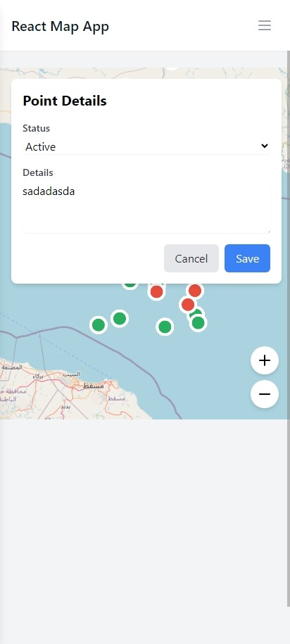

# OpenStreetMap Points Editor


## Table of Contents

- [Introduction](#introduction)
- [Features](#features)
- [Getting Started](#getting-started)
  - [Prerequisites](#prerequisites)
  - [Installation](#installation)
- [Usage](#usage)

## Introduction

OpenStreetMap Points Editor is a web application built with Vite and React that allows users to interact with OpenStreetMap data. Users can view the map, add custom points of interest, edit existing points, and save their changes locally.

## Features

- Interactive OpenStreetMap integration
- Add custom points of interest
- Edit existing points
- Save changes locally
- Responsive design for desktop and mobile use



## Getting Started

### Prerequisites

- Node.js (v14.0.0 or later)
- npm (v6.0.0 or later)

### Installation

1. Clone the repository:

   ```
   git clone https://github.com/yourusername/osm-points-editor.git
   ```

2. Navigate to the project directory:

   ```
   cd osm-points-editor
   ```

3. Install dependencies:

   ```
   npm install
   ```

4. Start the development server:

   ```
   npm run dev
   ```

5. Open your browser and visit `http://localhost:5173`

## Usage

1. **Viewing the Map**: Upon loading the application, you'll see the OpenStreetMap interface.

2. **Adding a Point**: Click on the "Add Point" button and then click on the map where you want to add the new point. Fill in the details in the popup form.

3. **Editing a Point**: Click on an existing point on the map. Edit the details in the popup form.

4. **Saving Changes**: Changes are automatically saved locally. To persist changes across sessions, implement a backend service.
